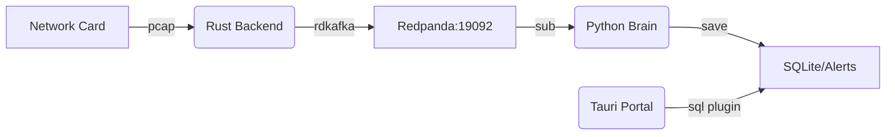

# Vesper-Insight

高性能智能化全栈分析套件。集成 Rust 数据采集、Python AI 异常检测与 Tauri v2 可视化前端。

## 源码结构 (Structure)
- `src/`: Rust 高性能数据采集后端 (`pcap` + `rdkafka`)
- `src/brain/`: Python AI 分析引擎 (`river` + `torch` + `uv`)
- `src/portal/`: Tauri v2 可视化前端 (`Vite` + `TS`)

## 环境准备 (Prerequisites)
在使用本项目前，请确保系统中已安装以下工具：
- **Go-Task**: `sudo snap install task --classic` 或按照官方文档安装。
- **UV**: Python 依赖管理工具。
- **Rust/Cargo**: 2024 Edition。
- **Node.js**: 用于前端开发。

## 快速启动 (Quick Start)

### 1. 环境初始化
从头开始配置环境：
```bash
task init-py  # 初始化 Python 虚拟环境并安装核心依赖
task sync     # 对齐系统环境配置
```

### 2. 基础设施审计
确保所有后台服务（如 Redpanda）已就绪：
```bash
task check
```

### 3. 运行套件
建议按以下顺序启动组件：

1.  **启动数据采集 (Rust Backend)**
    ```bash
    task run-ingestion
    ```
    *注：脚本会自动请求 `sudo` 以执行 `setcap`，确保网卡原始包捕获权限。*

2.  **启动 AI 分析引擎 (Python Brain)**
    ```bash
    task run-brain
    ```

3.  **启动可视化前端 (Tauri Portal)**
    ```bash
    task run-portal
    ```
    > [!IMPORTANT]
    > **请务必查看弹出的桌面应用窗口**：本项目依赖 Tauri 原生 SQL 插件读取数据。虽然 Vite 会启动一个浏览器预览地址（localhost:5173），但由于浏览器安全沙箱限制，它无法读取本地数据库，数据会显示为 0。只有在**桌面窗口**中才能看到实时异常分析。

## 数据流向 (Data Flow)


## 开发与维护 (Maintenance)

- **环境自愈**: 报错时尝试运行 `task sync`。
- **Python 依赖**: 使用 `uv add <package>` 在 `src/brain` 目录下管理。
- **Rust 审计**: 在提交代码前运行 `task build-rust` 进行快速静态检查。

## 开发规范
- **命名**: 源码文件名遵循 `snake_case`。
- **安全**: 核心逻辑严禁使用 `unsafe`。
- **构建**: 生产环境执行 `cargo build --release`。
